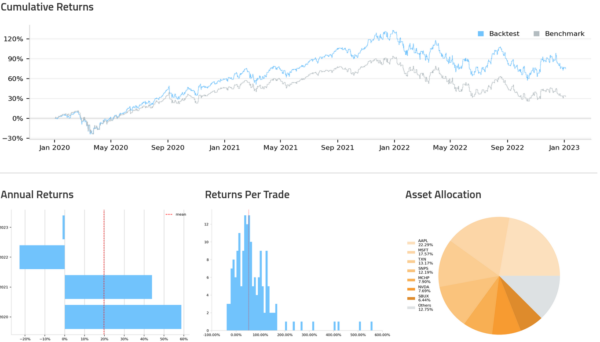

# Democratizing Index Tracking: A GNN-based Meta-Learning Method for Sparse Portfolio Optimization

Investing in stocks is a popular way for individuals to grow their wealth and diversify their investment portfolio, but many exchange-traded funds (ETFs) and mutual funds that offer actively managed index funds are not available to small investors in Europe due to UCITS regulations. An approach, called sparse index tracking, allows EU investors to create their own portfolio of stocks based on an index. However, selecting the optimal portfolio from thousands of stocks can be a complex and time-consuming task.

To address this issue, I have developed a novel population-based optimization method using a deep generative neural network trained with policy gradient to sample high-quality candidates. I have compared the method to a state-of-the-art optimization algorithm (Fast CMA-ES) and have found that it is more efficient at finding optimal solutions. Both methods are implemented on GPU using the PyTorch framework and are available in this repository together with the dataset for reproducibility and further improvement.

