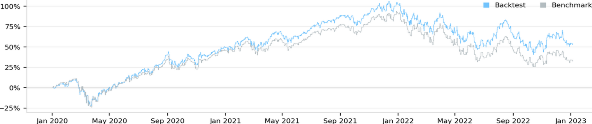

# Democratizing Index Tracking: A GNN-based Meta-Learning Method for Sparse Portfolio Optimization
Investing in stocks is a popular way for individuals to grow their wealth and diversify their investment portfolio, but many exchange-traded funds (ETFs) and mutual funds that offer actively managed index funds are not available to small investors in Europe due to UCITS regulations. An approach, called sparse index tracking, can allow investors to create their own sparse stock portfolio for tracking an index. However, selecting the optimal portfolio from thousands of stocks is a sophisticated and resource-intensive task.

To address this issue, I have developed a novel population-based optimization method employing a Deep Generative Neural Network trained with policy gradient to sample high-quality candidates. I have compared it against the state-of-the-art evolutionary strategy (Fast CMA-ES) and have found that it is more efficient at finding optimal solutions. Both methods are implemented on GPU using the PyTorch framework and are available in this repository (together with [the dataset](https://drive.google.com/file/d/1RVhboDO3u_subUgG1G8rwdY7Ar6Dyrxf/view?usp=sharing)) for their reproducibility and further improvement.

Before running **main.py**, download **Dataset.pkl** from the below link and place it to this folder:  
https://drive.google.com/file/d/1RVhboDO3u_subUgG1G8rwdY7Ar6Dyrxf/view?usp=sharing  

The key for out-of-sample robustness in portfolio optimization is quality-diversity optimization, where one aims to obtain multiple diverse solutions of high quality, rather than one. Generative meta-learning is the only portfolio optimization method that performs QD optimization to obtain a robust ensemble portfolio consisting of several de-correlated sub-portfolios. In the below image, the red line is the index to be tracked, the blue line is the sparse portfolio ensembled from a thousand behaviorally-diverse sub-portfolios co-optimized (other lines).

In Gen-Meta portfolio optimization, a Monte-Carlo optimization is performed over those portfolio candidates to reward each individual separately in randomly selected historical periods. To further optimize the portfolio robustness, the portfolio weights of the candidates are heavily corrupted first by adding noise and then dropping out the vast majority of their weights.
